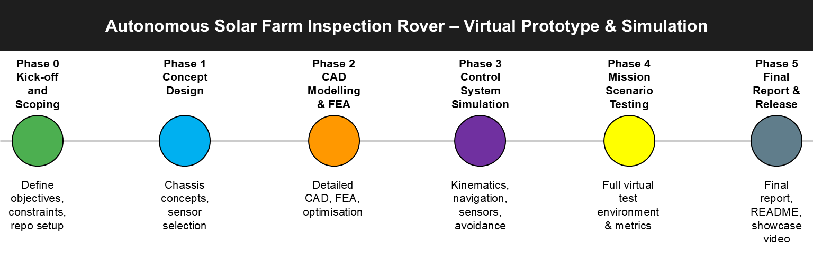
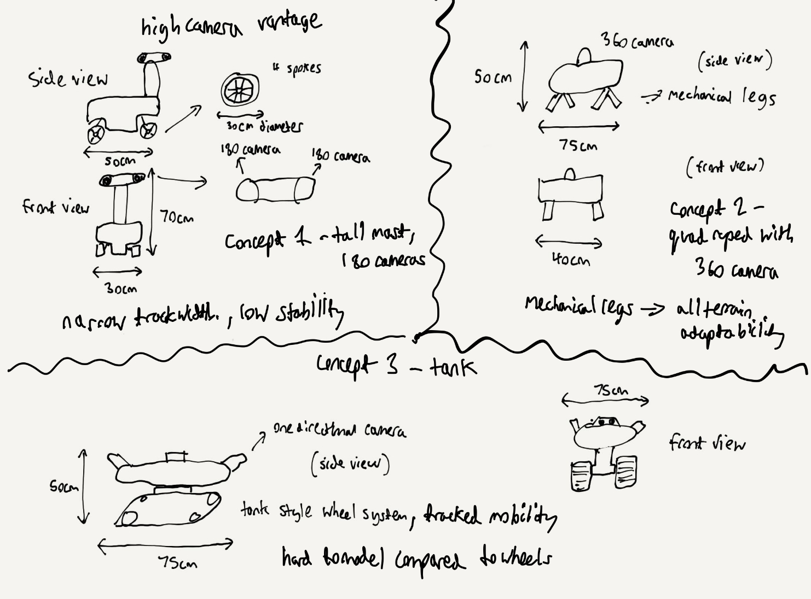

# Autonomous Solar Farm Inspection Rover – Virtual Prototype & Simulation

**Virtual prototype and simulation** of an autonomous rover designed for solar farm inspection.
This project covers the complete design cycle — from concept and CAD modelling, through structural optimisation, to control system simulation and mission scenario testing in a virtual environment. All work is conducted virtually, allowing for rapid iteration and testing before any physical prototyping.

---

## Project Overview

This rover is designed to autonomously navigate between solar panel rows, detect and avoid obstacles, and perform basic fault detection using simulated sensors.  
The project is being developed entirely virtually, with all CAD, analysis, and control systems tested in simulation environments.

**Key capabilities:**
- Autonomous navigation between panel rows.
- LiDAR-based obstacle detection and avoidance.
- Path planning to maximise inspection coverage.
- Basic panel fault detection via camera simulation.

---

## Mission Scenario

**Environment:**  
Outdoor solar farm with gravel/dirt access paths, occasional puddles, and panel rows spaced 2–3 m apart.

**Success Criteria:**
1. Navigate a 50 m inspection route with obstacles in under 90 s.
2. Detect and log all simulated faults within the panel rows.
3. Maintain ≥95% uptime (no getting stuck) over 10 consecutive runs.

---

## Technical Scope

| Domain                  | Tools / Methods |
|-------------------------|-----------------|
| CAD Modelling           | SOLIDWORKS / Fusion 360 |
| Structural Analysis     | FEA – bending, torsion, impact |
| Optimisation            | Topology optimisation for weight reduction |
| Control Systems         | MATLAB / Simulink or Python + ROS |
| Sensor Simulation       | LiDAR, RGB camera, ultrasonic sensors |
| Path Planning           | A*, RRT, coverage path optimisation |
| Virtual Testing         | Gazebo / Webots / Unity environments |

---

## Project Structure

```plaintext
/docs       → Project brief, design logs, phase summaries
/models     → CAD files (.sldprt, .f3d, .step)
/renders    → CAD and simulation renders
/code       → Simulation and control code
/videos     → Simulation demo clips
```

---

## Development Roadmap



Phase 0 – **Kick-off & Scoping** ✅

- Project brief completed (docs/Project_Brief.pdf)

- Repository created and structured

Phase 1 – **Concept Design** ⏳ (in progress)

- Chassis and drive system concepts

-   
_See [concept notes](renders/phase1_concept_notes.md) for details._

- Sensor suite selection

Phase 2 – **CAD Modelling & FEA**

- Detailed chassis model, FEA (bending/torsion/impact) and topology optimisation

Phase 3 – **Control System Simulation**

- Kinematics, PID/MPC navigation, LiDAR + camera simulation, obstacle avoidance

Phase 4 – **Mission Scenario Testing**

- Virtual solar farm environment, performance metrics, demo videos

Phase 5 – **Final Report & Public Release**

- Final report, polished README, and showcase video

---

## License

This project is licensed under the MIT License (LICENSE).

---

##  Contact

Developed by William Cook

LinkedIn: https://www.linkedin.com/in/william-g-cook/

GitHub: https://github.com/willcook415
